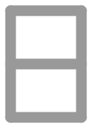

# Etruscan
The SVG glyphs in this directory are licensed under a CC0-1.0 license.

                    

**Source:** [Bonfante, J. H., 1983, The Etruscan language : an introduction](https://archive.org/details/etruscanlanguage0000bonf/page/64)